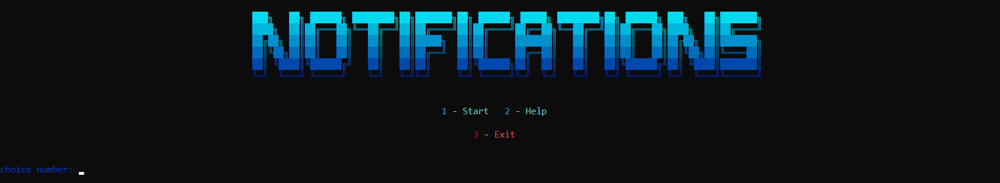
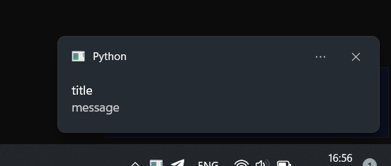

***
**С помощью данного скрипта вы можете создавать уведомления с помощью бибилиотеки ``plyer``**
***
## pip
``pip install plyer``
``pip install colorama``
***
## Помощь по использованию

1. **``Title`` - название окна | заголовок**
2. **``Message`` - текст в уведомлении**
3. **``app_name`` - название приложения**
4. **``timeout`` - сколько времени будет отображаться уведомление (только целые числа)**

### Пример

